# Express Entry Bot

Telegram bot to track latest drafts for [Express Entry](https://www.canada.ca/en/immigration-refugees-citizenship/services/immigrate-canada/express-entry.html) immigration program to Canada.

Start using: https://t.me/CaImmigrationBot.

## Features

- Subscribe to get notified about the latest round
- Get information about the last round
- Get information about last 50 rounds
- Get current applicants' score distribution
- Display the data on a dashboard

## Architecture

```mermaid
graph LR;

canada("🇨🇦 EE Website");
aws("☁️ AWS Lambda");
mongo[("🌿 MongoDB")];
bot("🤖 Telegram Bot");
users("💁 Users");
dashboard("📊 Dashboard")

users-->bot<-->mongo<-->aws-->canada;
users-->dashboard-->canada;
```



\
🇨🇦 **Express Entry Website**. Information about all express entry rounds is published on a website and is publicly available in JSON format.

☁️ **AWS Lambda**. JavaScript function scheduled to run every 30 minutes - fetches data from the Express Entry Website, fetched data from MongoDB, filters only new data, inserts new data into MongoDB.

🌿 **MongoDB**. The main data storage in this project. Namely, it stores _clean_ Express Entry (EE) round statistics, applicant distributions, and Telegram Users (e.g. subscribers). MongoDB instance has a trigger configured - every time new data is inserted by AWS Lambda function, MongoDB sends a signal to Telegram Bot to notify its subscribers of a new round.

🤖 **Telegram Bot**. A bot that has some commands available to users. Fetches data from MongoDB, formats it as a message and sends it to the users upon request. Also allows users to subscibe to new round notifications.

💁 **Users**. Normal users and subscribers of the Telegram Bot - can send commands or subscribe to updates.

📊 **Dashboard**. Provides visual access to the Express Entry data. Fetches data directly from Express Entry Website. Developed in a [separate repository](https://github.com/Gotfrid/canadian-express).

## Infrastructure

The bot is deployed to [fly.io](http://fly.io/) free tier. The bot is working in polling mode.

Data is stored in MongoDB which is deployed at [MongoDB Atlas](https://www.mongodb.com/atlas) free tier.

New data is checked with an [AWS Lambda](https://aws.amazon.com/lambda/) function which is invoked every 30 minutes. Overall number and duration of invocations allow to stay in the free tier.

Dashboard is deployed at [Vercel](https://vercel.com) free tier.

## Deployment

#### Telegram bot

This bot relies on a lambda fucntion that runs every 5 minutes and pushed new data (if any) to the MongoDB.

#### Database

MongoDB Atlas instance is created manually - deployment is handled by the Atlas team.

#### AWS Lambda

This function is deployed manually as a zip archive that includes all contents related to aws code.

```sh
zip -r deploy.zip ./src ./node_modules ./package.json ./.env ./index.js
```

#### Dashboard

Dashboard is deployed to Vercel automatically via connected git repository.

## Testing

TODO

## Contributing

TODO
